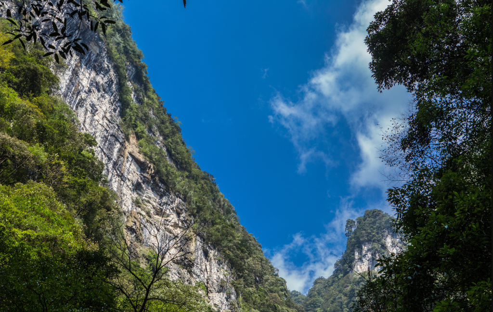

#《新韵·清明游黑山谷》
>> 清明节与妻友游黑山谷，吾独行至峡谷中忽有所感，遂作诗以记。

```
正是清明天朗日，黑山谷里好逢春。
花同嫩叶送幽味，鸟与流波起禅音。
满目枝摇红渐绿，长风云动古通今。
谁知寒武亿年后，万丈峡中吾一人！
```



# 赏析
```
前两联写黑山谷的暮春景致——清明时节天朗气清，深谷中春意正浓。颔联从嗅觉与听觉入手："花同嫩叶送幽味"写花叶交织的清香，"鸟与流波起禅音"以"禅音"形容鸟鸣水声的空灵，自然之声被赋予了超脱尘俗的意味。

颈联"满目枝摇红渐绿"写春去夏来的色彩渐变，"长风云动古通今"则将长风与流云置于古今贯通的时空之中，视野开阔。尾联是全诗最大亮点——"谁知寒武亿年后，万丈峡中吾一人！"诗人忽然追溯到亿万年前的寒武纪地层，感叹在这历经亿万年地质演变而成的峡谷中，此刻只有自己一人独行。用地质学的时间尺度来反衬个体的存在，将一次普通的清明出游提升到面对永恒与刹那的哲学思考高度。结尾一个"！"感叹号，将其中的震撼、惊奇与骄傲一并道出，读来令人心潮澎湃。
```

