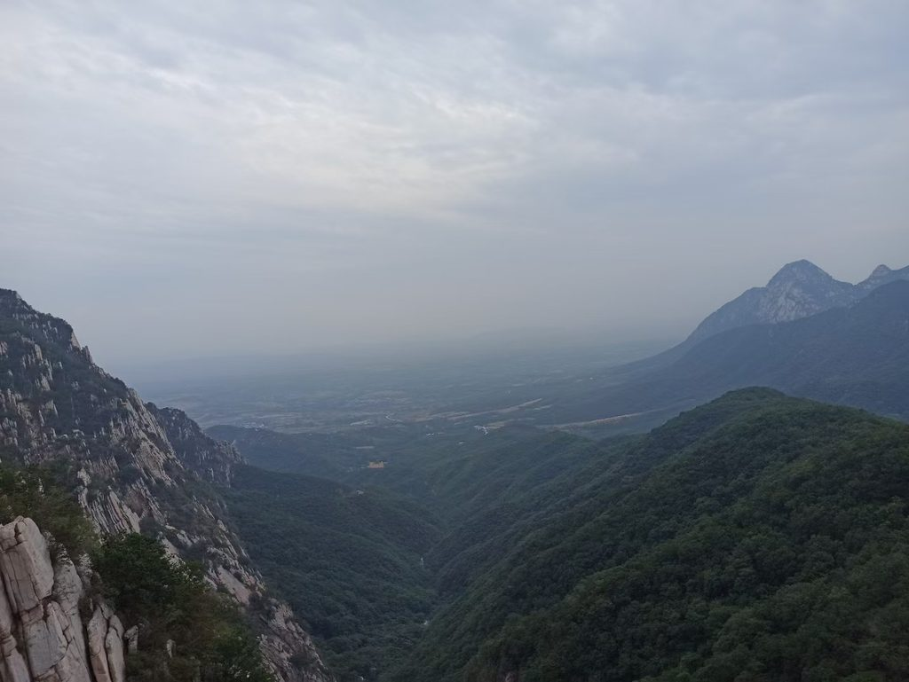

# 《通韵·三山五岳之嵩山游记》

```
万古浮云随落日，悠悠天地卧嵩山。
将军柏下王朝换，书册崖边海陆迁。
女帝崩殂封祀后，少林兴盛火焚前。
老夫不问荣枯事，直向峻极峰顶攀！
```
>> 写于20250626



# 赏析
```
此诗登嵩山而俯仰古今，气象浑厚。首联"万古浮云随落日"以浮云落日勾勒时间的流逝感，"悠悠天地卧嵩山"以"卧"字写出嵩山的沉静与永恒——天地苍茫，嵩山静卧其间，见惯了多少沧桑。

中二联以嵩山的标志性景物为线索展开历史画卷——将军柏见证了王朝的更替，书册崖记录了海陆的变迁（地质层理如书页，曾是海底）；女帝武则天的封祀大典早已成往事，少林寺历经兴盛与火劫。四组意象涵盖了自然史与人类史的双重时间尺度，内涵极为丰富。

尾联"老夫不问荣枯事，直向峻极峰顶攀"气魄尽出——管它什么王朝兴替、沧海桑田，我自向峻极峰顶奋力攀登！以登山之举对抗历史的沉重，洒脱豪迈，有不以物喜、不以己悲的旷达胸襟。
```