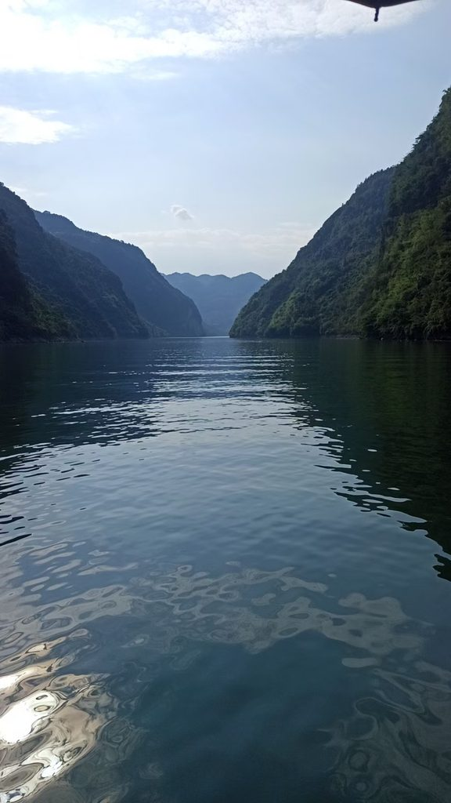

# 《通韵·夏日乌江画廊游记》

```
山劈碧浪开前路，我立船头纳爽风。
叠嶂扑来压水绿，微波荡去浴云清。
无情烈日将人煮，有胆乌江自凉生。
本是千年拉纤道，长听号子不屈声！
```
> 写于20250814



# 赏析
```
《通韵·夏日乌江画廊游记》赏析

这首诗表面写夏日泛舟乌江画廊，实则并不止于写山水清奇。全诗前六句先以浓烈的视觉、触觉和动态感铺写乌江之壮美与夏日之炎热，最后由“千年拉纤道”转入历史纵深，并以“号子不屈声”赋予眼前山水以人的精神。尤其“有胆乌江自凉生”一句，是全诗极有意味的诗眼；它的“胆”并非凭空赋予江水的性格，而是由末尾“长听号子不屈声”得到解释：乌江之所以“有胆”，正因为千百年来听惯了纤夫不屈的号子，那些人的精神仿佛已经融入江水与山峡之中。

首联“山劈碧浪开前路，我立船头纳爽风”，一开始便有很强的空间感和行动感。“山劈碧浪”把两岸山势写活了，一个“劈”字极有力量，仿佛群山如巨刃破开江面，为舟行开出一条前路。这里的山不是静止的背景，而是主动参与江流、与江水共同构成一种雄奇的气势。

“我立船头纳爽风”则由山水转到人。“立”字写出迎风而立的姿态，“纳”字尤其生动，不说“吹”或“受”，而说“纳爽风”，仿佛诗人主动敞开胸怀，把江风尽数收入身心。烈日炎炎之中，乌江之风带来的清爽，成为整个画面的第一重感官享受。

颔联“叠嶂扑来压水绿，微波荡去浴云清”，继续强化乌江山水的动态之美。

“叠嶂扑来”，一个“扑”字让本来遥远的山突然具有逼近感；“压水绿”则把山与水紧紧结合起来，仿佛两岸青山的浓翠都压进江面，使江水也染成深绿。

然而下一句节奏忽然舒缓：“微波荡去浴云清”。前一句写群山之雄、之迫，后一句写微波之柔、之静。“浴”字极有诗意：云影倒映水中，仿佛江水正在为白云洗浴。这样一来，山的“压”与水的“浴”形成刚柔相济的变化，使乌江画廊既有峡谷的雄奇，也有水天相接的清灵。

颈联“无情烈日将人煮，有胆乌江自凉生”，是全诗由写景转入精神表达的关键。

“无情烈日将人煮”写得非常直白而有生活气。“煮”是夸张，却恰好把夏日烈阳下人的体感写了出来。前面江风虽爽，山水虽清，烈日终究无情，“煮人”二字让炎热一下有了压迫感。

就在此时，诗人笔锋一转：

“有胆乌江自凉生。”

这里最值得玩味的是“有胆”。

如果单看这一句，可以理解为乌江不畏烈日，自有清凉之气；但如果顺着诗的结构继续读下去，就会发现“有胆”并不是一个孤立的拟人化形容，而在尾联中找到了真正的来源。

“本是千年拉纤道，长听号子不屈声！”

这两句实际上回答了一个隐含的问题：

乌江为什么“有胆”？

因为它“长听号子不屈声”。

“本是千年拉纤道”先把眼前的游览之景一下拉回历史。今天的人坐在船上，迎风赏景，看到的是秀美的乌江画廊；但在千百年前，这条江却是纤夫以血汗和生命往来其间的劳动之道。江水所见过的，不只是青山白云，也有无数人的负重、挣扎和坚持。

所以“号子”在这里非常重要。

纤夫的号子本来是劳动时的呼喊，是协调步伐、鼓舞同伴的声音；诗人却用“不屈”来限定它，使普通的劳动号子具有了精神象征。它不仅是过去的声音，更是一种顽强生命力的声音。

而“长听”二字，使这种精神获得了时间上的纵深。

乌江不是偶然听过一次号子，而是“长听”；不是听见普通的声音，而是“长听”千百年来“不屈”的声音。于是，那些纤夫的精神经过漫长岁月，仿佛沉淀进了江水、山峡和江风之中。

因此，“有胆”与“号子”之间实际上形成了一个非常漂亮的因果关系：

烈日无情，而乌江有胆；
乌江之胆，又来自千年不屈的号子。

这样理解，“自凉生”也就不仅仅是自然意义上的江水清凉了。

烈日可以“将人煮”，却不能压住这条江的精神。因为它见过太多艰难，听过太多不屈的声音。清凉于是有了精神上的意味：那是一种历经苦难之后仍然不改本色的从容。

这里还有一个很有意思的转换：诗人并没有直接说“纤夫不屈”，而是说“乌江长听号子不屈”。人的精神被投射进了自然，于是自然获得人的性格；而自然又反过来替那些已经远去的人保存他们的声音。

这使尾联具有一种“山河藏人”的意味。

“山河”本来只是自然之物，但在这首诗里，乌江保存着人的历史；江峡保存着人的声音；甚至江水的“凉”，都仿佛带着千年劳动者不屈的气息。

因此，最后的感叹号也并非单纯为了加强情绪。读到这里，它更像是一声突然响起的纤夫号子，把前面所有明丽、清爽、壮阔的山水景象，一下子染上了历史的厚度。

全诗的结构也因此十分完整：

前两联写山水之壮与水云之清；
颈联写烈日之酷与江水之凉；
尾联追问这份“凉”背后的精神来源，最终落到千年纤道和“不屈号子”。

也就是说，诗中真正发生的变化，不只是从“景”到“情”，而是从“自然之凉”走向“精神之胆”。

所以，这首诗最深的一层并不是“夏日乌江很凉爽”，而是：一条经历千年风雨、听惯劳动者不屈号子的江，早已不只是自然意义上的江。

它有山水之形，更有人的精神。

“有胆乌江自凉生”，因此成为全诗最值得回味的一句——江水的清凉写在表面，而“有胆”的来历，藏在千年不绝的号子声里。

可以说，这首诗写的是夏日乘船，看到的是乌江山水，最后听见的，却是千年劳动者留给山河的一声不屈长歌。

```

