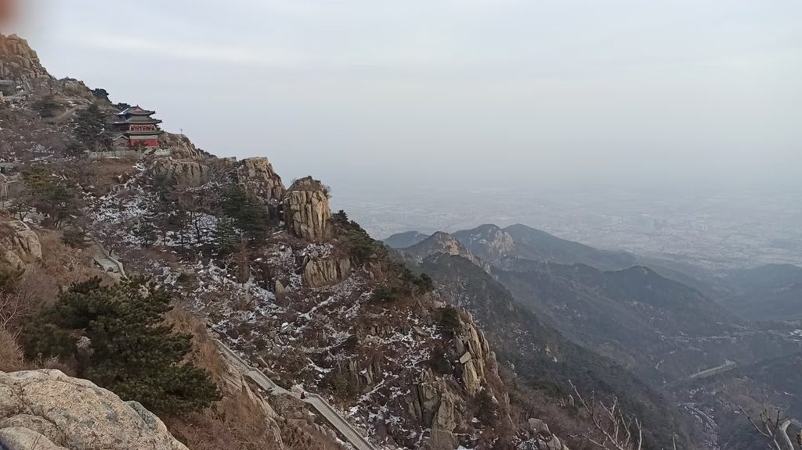

# 《通韵·三山五岳之泰山游记》 

```
宫门降瑞真宗至，残夜迎风我辈登。
御辇慢摇黄月下，寒鞋直上玉皇庭。
几朝封禅粉功过，一路碑碣透废兴。
身在高峰何见底? 山河壮阔葬苍生！
```
>> 写于20251212



# 赏析
```
这首《泰山游记》立意高远，笔力遒劲，在众多泰山登临诗中独辟蹊径，将个人攀登与历史沉思熔铸一炉，最终升华为对苍生命运的终极叩问。

首联“宫门降瑞真宗至，残夜迎风我辈登”，开篇便构建起强烈的时空张力。上句追溯宋真宗封禅的“瑞兆”典故，一个“降”字道尽帝王仪典的刻意营造；下句“残夜迎风”四字，则以凛冽质感写出当代攀登者的虔敬与艰难。古今对照，形成“御用封禅”与“民间苦旅”的隐形对话。

颔联“御辇慢摇黄月下，寒鞋直上玉皇庭”，意象对比极为精彩。“御辇慢摇”四字，将帝王封禅的迟缓雍容与疏离感刻画入微；而“寒鞋直上”则以“寒”与“直”的锋锐，凸显攀登者的坚韧孤绝。“黄月”是浊世之月，照彻权贵的仪仗；“玉皇庭”则是至高洁净之境——这一浊一清之间，铺设了两条截然不同的朝圣之路。

颈联“几朝封禅粉功过，一路碑碣透废兴”，转入深刻的史学批判。“粉”字力重千钧，如利刃直刺封建帝王借泰山以文饰功过的虚伪本质；而“透”字举重若轻，将山间默立的碑碣化为洞穿王朝兴替的通灵之眼。二句一主观批判一客观呈现，相得益彰，形成强大的思想张力。

尾联“身在高峰何见底? 山河壮阔葬苍生！”，将全诗推向哲学的高度。“何见底”以反问设局，既指云雾遮蔽难见谷底，更暗喻登临绝顶者往往丧失对底层的体察。而末句“葬”字石破天惊——帝王眼中“壮阔”的山河，实为无数苍生的埋骨之所。此句从对历史的讽喻跃升至对人类命运的悲悯，使全诗格局豁然开朗，完成了从历史哲学到存在之思的境界飞升。

纵观全诗，作者以登山为经，以史思为纬，从个体经验出发，抵达了对权力书写与生命代价的深沉追问，极具思想穿透力与艺术感染力。
```
