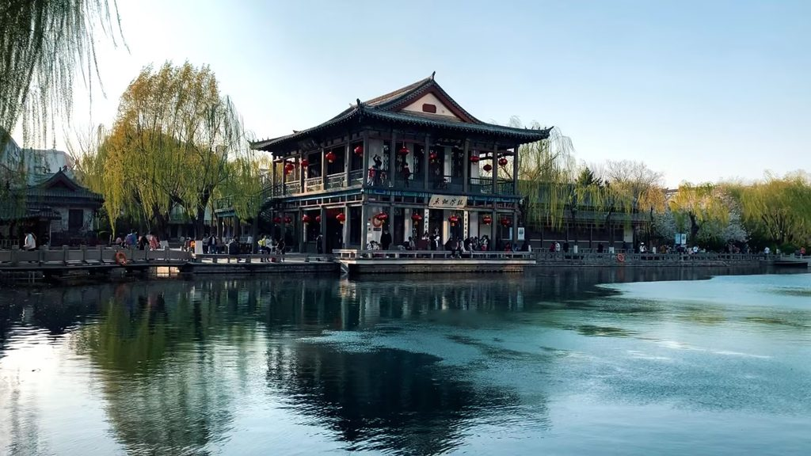

# 《通韵·冬日济南五龙潭观鱼》 

```
垂柳沾金摇华年，甘泉透玉落长天
清幽黑鲤诗山水，老朽如石合此篇
```
>> 写于20251214



# 赏析
```
前两句写五龙潭冬日景致——"垂柳沾金摇华年"写柳条在冬日暖阳下镀上一层金色，随风轻摇，仿佛在摇动岁月的光华；"甘泉透玉落长天"写潭水清澈如透明的玉液，从长天（指泉源高处）倾泻而下，晶莹剔透。两组意象一幅静谧、一幅灵动，将五龙潭的清冽之美展现出来。

后两句由景及人——"清幽黑鲤诗山水"，潭中黑色的鲤鱼在碧水中悠然游动，本身就是一首流动的山水诗。"老朽如石合此篇"以自嘲的语气收束：诗人把自己比作潭边一块不起眼的石头，和这篇山水之诗恰恰相合。"如石"既是自谦之词，也暗含一种与自然融为一体的安稳与归属感——不求醒目，只求合契。全诗简淡自然，写景如画，心境平和，是济南冬日赏鱼的最佳注脚。
```
