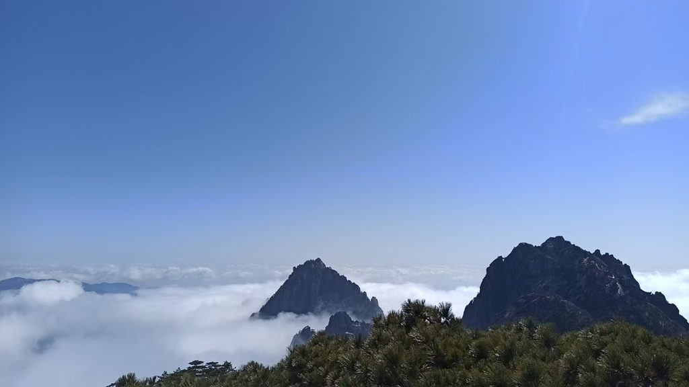

# 《平水·三山五岳之黄山游记》

```
黄帝栖真曾炼药，诗仙掷笔自生花。
峰生云海浮如岛，雾透霞光薄似纱。
一石飞来凝日月，千松迎送塑风沙。
游人络绎朝朝至，莫怪仙翁不在家。
```
>> 写于20260218

 

# 赏析
```
这首《平水·三山五岳之黄山游记》是一首格律严谨、意境优美且极富趣味的七言律诗。诗人以游历黄山为脉络，将黄山的神话传说、经典景观（奇松、怪石、云海）与人文历史融为一体，并在结尾以幽默诙谐之笔收束，气象万千又生动活泼。

以下是对这首诗的详细赏析：

一、 逐联品析
首联：黄帝栖真曾炼药，诗仙掷笔自生花。
解析：起笔不凡，直接从黄山的历史传说与文化底蕴入题。
“黄帝栖真曾炼药”化用了黄山得名的传说——相传轩辕黄帝曾在此修真炼丹、羽化登仙（黄山原名黟山，唐玄宗因黄帝传说而改名黄山）。
“诗仙掷笔自生花”则巧妙融合了李白游黄山的典故与黄山著名景观“梦笔生花”。
作用：首联以“仙气”与“诗意”奠定全诗基调，赋予了这座名山厚重的人文与神话色彩。
颔联：峰生云海浮如岛，雾透霞光薄似纱。
解析：此联由人文转向大自然的宏大图景，描写黄山“四绝”之一的云海与光影变化。
出句“峰生云海浮如岛”，以宏观视角写云海翻腾，奇峰在云雾中若隐若现，宛如汪洋大海中的蓬莱仙岛，极富动感与仙气。
对句“雾透霞光薄似纱”，转入微观与光影的捕捉，晨曦或晚霞透过薄雾洒下，轻柔如轻纱曼妙。
艺术特色：对仗工整，“浮如岛”与“薄似纱”两个比喻一雄奇、一柔美，虚实相映，如同一幅动态的水墨画卷。
颈联：一石飞来凝日月，千松迎送塑风沙。
解析：颈联聚焦黄山的另外“两绝”——怪石与奇松，且暗点名胜。
出句“一石飞来凝日月”，化用了黄山绝景“飞来石”，一“凝”字赋予顽石以天地灵气与时光的沉淀感，显得苍茫厚重。
对句“千松迎送塑风沙”，则包含了著名的“迎客松”与“送客松”。黄山的松树在风沙严寒中傲然挺立，历经岁月洗礼，展现出坚韧的风骨。
艺术特色：炼字精妙，“凝”与“塑”二字动静结合，赋予自然景物以生命力与历史厚重感。
尾联：游人络绎朝朝至，莫怪仙翁不在家。
解析：尾联峰回路转，由“景”入“情”，由“仙境”回归“人间”。
黄山风光太美，引得“游人络绎朝朝至”，每天都是游人如织、人声鼎沸。
诗人以调侃风趣的口吻写道：“莫怪仙翁不在家”——难怪山里的神仙都不在家里待着，原来是被这络绎不绝的游人“吵”得出门躲清静去了，又或是隐入云海与人同乐。
作用：这一笔“翻新”极妙，既以侧面烘托的手法表现了黄山极高的人气与吸引力，又打破了传统游记诗容易流于空洞赞美的弊端，使整首诗充满了生活情趣和灵动之气。
二、 整体艺术特色
结构严谨，起承转合自然：

起（首联）：以神话、典故入诗，立意高远；
承（颔联）：写云海霞光的大景，营造仙境氛围；
转（颈联）：工笔细描奇石与苍松，展现黄山具体风貌；
合（尾联）：转入人事，以诙谐妙语收束，余味悠长。
典景交融，具象与意象统一：
诗中不着痕迹地将黄山标志性景观（梦笔生花、云海、飞来石、迎客松/送客松）以及黄帝、李白等文化符号串联成线，做到了“游记”有实景、“诗篇”有意境。

声律工稳，语言明丽：
全诗依平水韵（下平六麻韵：花、纱、沙、家），平仄谐协调，对仗工整，读来朗朗上口，音韵优美。

总结
这首诗既写出了黄山作为“天下第一奇山”的巍峨与空灵，又洋溢着现代游人赏景时的欢快与情趣。庄谐并重、仙凡交融，是一首形神兼备、富有诗意与趣味的当代优秀律诗。
```

